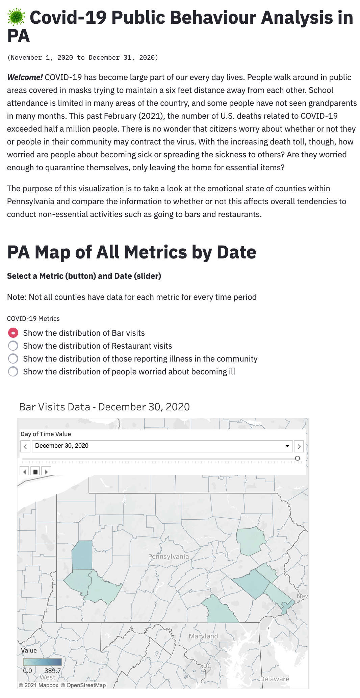
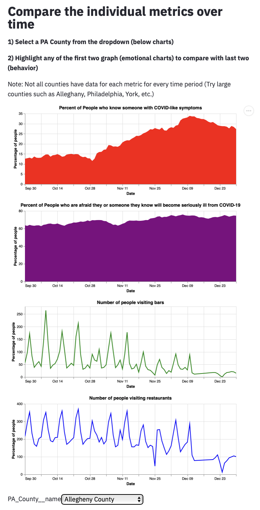
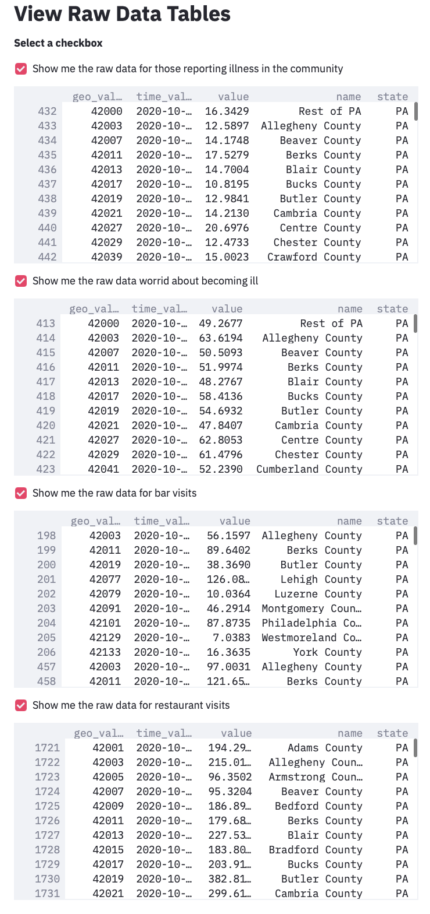

# Covid-19 Public Behaviour Analysis in PA 

ABSTRACT: COVID-19 has become large part of our every day lives. People walk around in public areas covered in masks trying to maintain a six feet distance away from each other. School attendance is limited in many areas of the country, and some people have not seen grandparents in many months. This past February (2021), the number of U.S. deaths related to COVID-19 exceeded half a million people. There is no wonder that citizens worry about whether or not they or people in their community may contract the virus. With the increasing death toll, though, how worried are people about becoming sick or spreading the sickness to others? Are they worried enough to quarantine themselves, only leaving the home for essential items? The purpose of this visualization is to take a look at the emotional state of counties within Pennsylvania and compare the information to whether or not this affects overall tendencies to conduct non-essential activities such as going to bars and restaurants.

## Project Goals

The goal of this project is to determine if people's concern are about whether or not they or members of their community become ill from COVID-19 affect their tendencies to conduct non-essential activities such as going to bars and restaurants. The focus is on Pennsylvania, the home of Carnegie Mellon University where this visualization is developed, and covers a two-month period (Nov-Dec 2020). This is an interesting period because it encompasses Thanksgiving and the winter holidays - events known to increase social gatherings between people. Users should be able to take a look at different counties, select the metrics that they want to observe, and easily make a comparison between the overall emotional state and the level of non-essential activities.

## Design
1) Overview Map on Top
When trying to tell our story, we wanted to put a large map of PA with access to all of the counties and data. This is our overview of all of the data as well as how it is spread across the counties. Depending on if there is data for the particular county on the specific date, the size of the circle located on a particular county would match the value of the particular metric. A set of radio buttons allow for selection between data sets. A dropdown menu allows for selecting the dates.

2) Detailed time vs. value charts
Next, we tried to get more into the details of the data but displaying four charts that display each of the different datasets.

3) Finally, there is an option to view the raw data, if someone were curious. This uses the checkbox tool.

4) Challenges
We encountered several challenges while working on this project. Because the data sets were from four different input sources as opposed to a single data set, we faced issues with the layering process. Altair typically works best with a combined data set using long-form. The primary issues involved linking them through the brushing and selection process for matching the brush selections as well as connecting the charts with a single dropdown for all of the counties. This was facilitated by using the vConcat function and adding the selection portion to only a single selection for a specific county. 

Another challenge was managing the large amount of data from each of our dataset. The first solution was to reduce our original plan to have the last 6 months to only a 2 month period. The data content was still rather large, and thus, it required caching the data so that it would load faster during multiple iterations and using a csv versus pulling from Covidcast. This also created sizing errors which limited the sizes of the circles on the map, which was solved by truncating anything larger than the max circle size. The biggest problem was that the streamlit app only allocates a certain amount of memory for the app. This would cause an error that was not noticeable when working locally.

Because of our unfamiliarity with altair, incorporating basic functions took more time than would for an experienced user. This included formatting the data types using pandas and SQL, manipulated the dataframes, adding aesthetics (color, lines vs points, selection filtering, tooltip, legends, axis labeling, chart location, etc.) We made many changes depending on if the aesthetics appeared to flow and were user friendly.

For future work, it would be interesting to show an increase of aggregation for the data (all of PA, all of the US) and to see the data over a larger time frame.

## Development

Once assigned the project, Janice (J) and Riddhiman (R) met at least twice a week to discuss the planning process and goals, reevaluate the direction of the project, and discuss any challenges or recommendations. In the first meeting, we focused on making a plan to meet certain milestones by the assignment due date and assigning responsibilities. J was responsibility for visualizing the emotional states as well as formatting the input data for the project, and R was responsibility for the map and the non-essential activities. Both contributed on ideas to help improve each other's area of focus as well as the overall scheme of the project. Because of the constraints of other classes, R conducted most of his programming during the earlier parts of the planning period, and J conducted the bulk of her programming during the later part. We still met before completing the assignment to agree on the design and make any last minute changes. Since Altair and Streamlit are new to both of us, it probably took about 20 hours each of programming time. Additionally, we conducted 5 one-hour long planning meetings and corresponded through email.

## Success Story

When looking at major counties such as Alleghany, Philadephia, and Chester counties, the general trend shows that as people are more worried about the effects of COVID-19 on themselves and their close family while also knowing someone in the community, the general trend for people going to bars and restaurants decreased. This is particularly interesting because this trend is mostly observed in the latter half of the time period in December, where more people are on vacation, have time off, and typically prefer to enjoy company with others.
